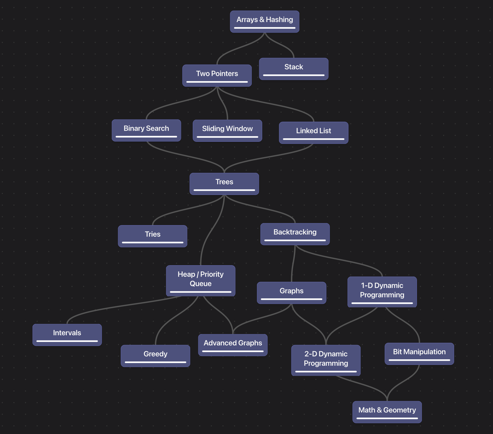

# TypeScript Algorithms Roadmap

Repositório de estudos de algoritmos e estruturas de dados em TypeScript, organizado a partir de uma trilha progressiva de problemas.

## Objetivos

- Aprender TypeScript resolvendo problemas práticos.
- Desenvolver raciocínio para decompor problemas em etapas menores.
- Reconhecer padrões de solução e escolher estruturas de dados adequadas.
- Analisar complexidade de tempo e espaço.
- Registrar as tentativas, soluções e aprendizados ao longo da trilha.

## Roadmap



### Progresso

- [x] Arrays & Hashing — Contains Duplicate
- [ ] Two Pointers
- [ ] Stack
- [ ] Binary Search
- [ ] Sliding Window
- [ ] Linked List
- [ ] Trees
- [ ] Tries
- [ ] Heap / Priority Queue
- [ ] Backtracking
- [ ] Graphs
- [ ] Advanced Graphs
- [ ] 1-D Dynamic Programming
- [ ] 2-D Dynamic Programming
- [ ] Greedy
- [ ] Intervals
- [ ] Bit Manipulation
- [ ] Math & Geometry

## Organização

```text
.
├── assets/
│   └── roadmap.png
├── problems/
│   └── containsDuplicate.MD
├── solutions/
│   └── containsDuplicate.ts
└── README.md
```

- `problems/`: enunciados, exemplos e restrições dos exercícios.
- `solutions/`: implementações em TypeScript.
- `assets/`: imagens e materiais de apoio.

## Como estudar cada problema

Para cada exercício, a ideia é seguir este processo:

1. Entender a entrada, a saída e as restrições.
2. Resolver um ou mais exemplos manualmente.
3. Escrever uma solução simples, mesmo que não seja a mais eficiente.
4. Identificar o padrão ou a estrutura de dados adequada.
5. Implementar a solução otimizada.
6. Testar casos normais, casos extremos e entradas vazias.
7. Registrar a complexidade de tempo e espaço.

## Problemas concluídos

### Contains Duplicate

Verifica se um array contém algum valor repetido.

- Abordagem inicial: comparar cada elemento com os seguintes, em `O(n²)`.
- Abordagem otimizada: usar `Set` para consultar valores já encontrados, em `O(n)`.
- [Enunciado](problems/containsDuplicate.MD)
- [Solução](solutions/containsDuplicate.ts)

## Tecnologias

- TypeScript
- Estruturas de dados e algoritmos
- Problemas de programação
